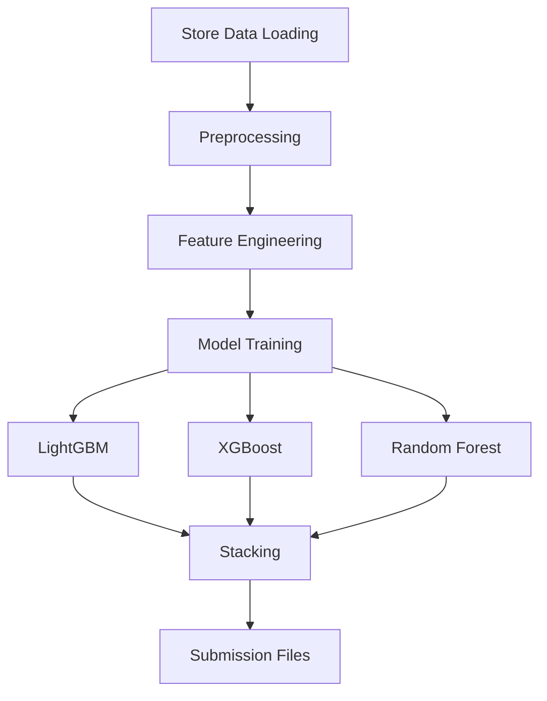
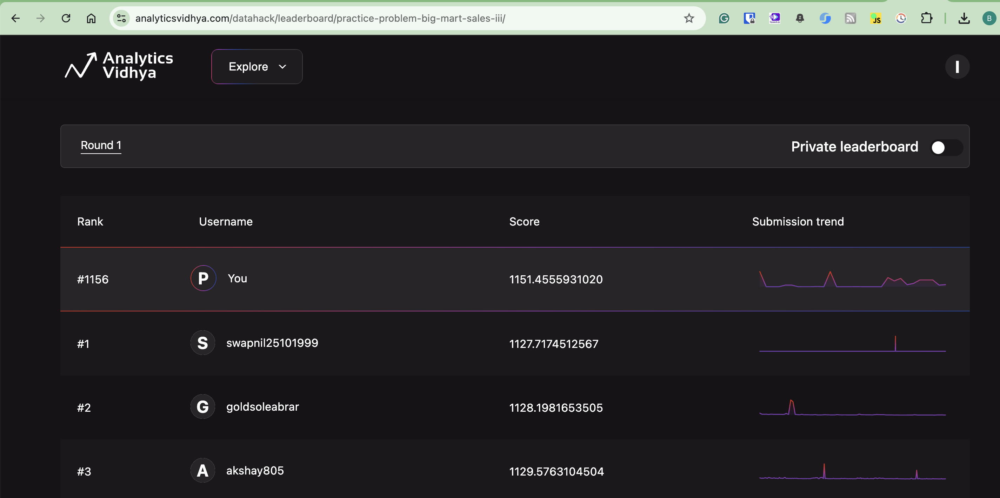

# BigMart Sales Prediction Pipeline: One-Page Summary

## Overview
This project aims to predict sales for BigMart outlets using historical sales data.

## Data Preprocessing & Feature Engineering
- **Missing Value Imputation:** Item weights, visibility, and outlet sizes are imputed using group values.
- **Feature Creation:** New features include item categories, outlet age, price/visibility bins, and interaction items 
- **Aggregated Features:** Outlet and item-type level statistics are merged to enrich the dataset.
- **Target Encoding:** KFold target encoding is applied to product and store identifier
- **Categorical Encoding:** Ordinal and one-hot encoding are used for categorical variables.
 ------------

##  Feature Engineering

Several new features are created to strengthen model signal:

### **Item-specific aggregations**
- Mean weight  
- Mean visibility  
- Mean MRP  

### **Outlet-level aggregations**
- Mean sales  
- Number of items sold  

### **Visibility correction**
- Replaces zeros with average visibility per item (common BigMart fix)

### **Combined features**
- `Price_per_unit_weight`  
- `MRP_bins` using MRP quantiles  
- `Outlet_Age` = year difference from establishment year  

### **Categorical encoding**
- Label Encoding is applied for all tree-based models.

## **Feature Engineering**

Several new features are created to strengthen model signal:

### **Item-specific aggregations**
- Mean weight  
- Mean visibility  
- Mean MRP  

### **Outlet-level aggregations**
- Mean sales  
- Number of items sold  

### **Visibility correction**
- Replaces zeros with average visibility per item (common BigMart fix)

### **Combined features**
- `Price_per_unit_weight`  
- `MRP_bins` using MRP quantiles  
- `Outlet_Age` = year difference from establishment year  

### **Categorical encoding**
- Label Encoding is applied for all tree-based models.

## **Cross-Validation Setup**

- Uses **k-fold cross-validation** (typically 5 folds).  
- Folds are **shuffled** to avoid outlet-based leakage.  
- **Out-of-fold (OOF) predictions** are stored for validation.  

## Modeling Approach
- **Models Used:** LightGBM, XGBoost, and Random Forest are trained using KFold cross-validation.
- **Meta-Model:** Out-of-fold predictions from base models are stacked and used to train a  regression model, which produces the final predictions.
- **Evaluation:** RMSE is used to assess model performance across folds.
- **Hyperparameter Tuning:** Optuna used for hyperparameter tuning

## Pipeline Flow
1. **Data Loading:** Reads train and test datasets from Google Drive
2. **Preprocessing:** Applies feature engineering and encoding to both train and test sets.
3. **Model Training:** Trains three base models with cross-validation and generates predictions.
4. **Stacking:** Combines base model outputs using a meta-model for improved accuracy.
5. **Submission Files:** Saves predictions for each model, the meta-model, and a simple average as CSV files for competition submission.

## Pipeline Flow Diagram

## Result Achieved
**RMSE Achieved:**  1151
**Leaderboard Position:** 1156
Approximately this model predicts only 25 items away from the leaderboard position(MAE ~ 0.8*RMSE)

## Things Tried That Did Not Help
1. Target encoding of item/store identifiers gave similar performance to label encoding.
2. Hyperparameter tuning after 200 trial didnt significantly help
3. Averaging submissions did not help so moved to meta model

